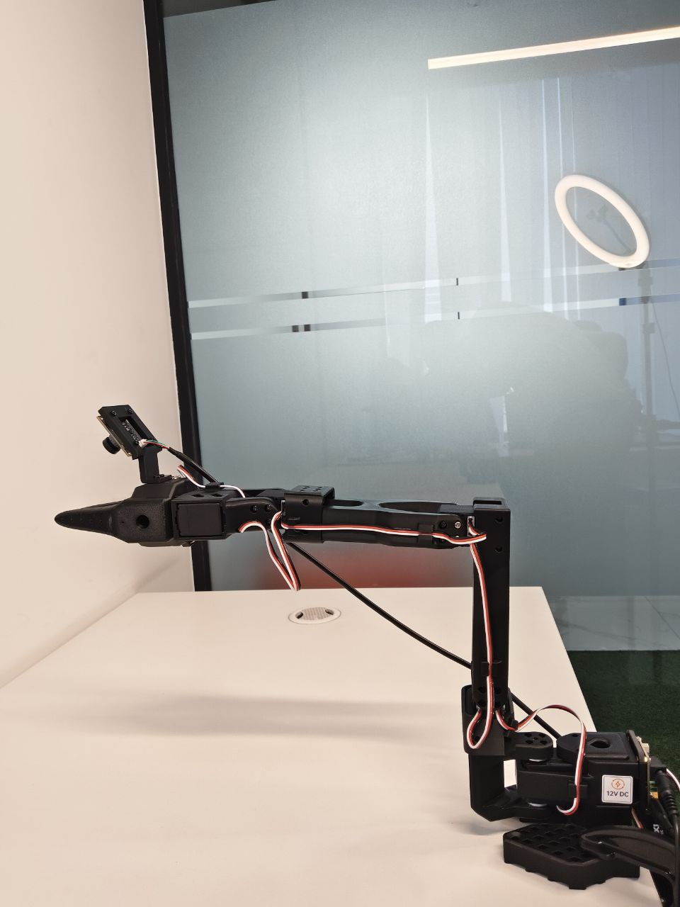

# Calibration and Teleoperation Guide

Hey everyone! Welcome to the **third guide** in our SO-101 LeRobot tutorial series.

Now that we have the software installed and hardware connected, it's time to calibrate the robots and test teleoperation! In this guide, we'll first calibrate both the leader and follower arms, then run teleoperation to control the follower arm using the leader arm. This is a crucial step to verify your setup before recording datasets.

Let's get your robots calibrated and working together! 

---

## What is Calibration?

Before you can use teleoperation, LeRobot needs to know the exact position of each motor in your robot arms. This process is called **calibration**.

When you run teleoperation for the first time, the system will:

1. Check if calibration data exists
2. If missing, it will ask you to calibrate each robot
3. Guide you through moving each motor to specific positions
4. Save the calibration data for future use

**Important:** You need to calibrate **both** the leader arm and the follower arm!

---

## What is Teleoperation?

Teleoperation allows you to control the **follower arm** (the robot that performs tasks) by moving the **leader arm** (the teleoperation device you control manually).

Think of it like this:

- You move the **leader arm** with your hands
- The **follower arm** mirrors those movements in real-time
- This is how you'll collect demonstration data for training

---

## Before You Start

Make sure you have completed the previous guides:

1. ✅ **Installation Guide** - All software installed
2. ✅ **Hardware Setup Guide** - Robots and cameras connected, COM ports identified

If you haven't identified your COM ports yet, go back to the [Hardware Setup Guide](02_hardware_setup.md) and complete Step 2.

---

## Step 1: Prepare for Calibration

### Required Starting Position

Before starting calibration, you need to position your robot in a specific **home position**. This is very important!



**Look at the image above carefully!** This shows the correct starting position for calibration:

- Arm should be in an upright, neutral position
- All joints in a relaxed state
- Gripper can be open or closed

Position **both** your leader arm and follower arm like this before starting.

---

## Step 2: Run Teleoperation (This Will Trigger Calibration)

When you run teleoperation for the first time, the system will automatically check for calibration files. If they don't exist, it will guide you through the calibration process.

Run this command (replace COM ports with your actual ports):

```bash
lerobot-teleoperate --robot.type=so101_follower --robot.port=COM10 --robot.id=my_awesome_follower_arm --teleop.type=so101_leader --teleop.port=COM9 --teleop.id=my_awesome_leader_arm
```

### Understanding the Command:

- `--robot.type=so101_follower` - Specifies the follower robot type
- `--robot.port=COM10` - **Your follower robot's COM port** (change this to your port!)
- `--robot.id=my_awesome_follower_arm` - A friendly name for the follower
- `--teleop.type=so101_leader` - Specifies the leader (teleoperation) device type
- `--teleop.port=COM9` - **Your leader robot's COM port** (change this to your port!)
- `--teleop.id=my_awesome_leader_arm` - A friendly name for the leader

**Important:** Make sure to use YOUR actual COM ports that you identified in the hardware setup guide!

---

## Step 3: Complete the Calibration Process

When calibration is needed, the system will guide you through it in this sequence:

### Calibration Sequence:

1. **Leader Arm Calibration First**

   - The system will ask you to calibrate the leader arm
   - It will prompt you to move each motor through its range of motion
   - Follow the on-screen instructions carefully
2. **Follower Arm Calibration Second**

   - After the leader arm is calibrated, it will ask for the follower arm
   - Same process - move each motor as instructed
   - Make sure to move motors smoothly and completely

### How to Perform Calibration:

Watch this video to see the calibration process in action:

<video width="640" height="480" controls>

<source src="assets/video_2026-01-12_17-59-15.mp4" type="video/mp4">
  Your browser does not support the video tag. <a href="assets/video_2026-01-12_17-59-15.mp4">Download the video here</a>.
</video>

**Key points from the video:**

- Start with the robot in the home position (see image from Step 1)
- Follow the prompts on screen
- Move each motor/joint slowly and smoothly
- Complete the full range of motion for each joint
- The system will save the calibration data automatically

**You need to do this for BOTH robots:**

- ✅ Leader arm calibration
- ✅ Follower arm calibration

---

## Step 4: Test Teleoperation

Once both robots are calibrated, the teleoperation will start! You should see:

- Connection messages for both robots
- No error messages
- The script waiting for input

Now try this:

1. **Gently move the leader arm** - Move it slowly at first
2. **Observe the follower arm** - It should mirror the leader's movements
3. **Test each joint** - Move each joint individually to verify all motors work
4. **Test the gripper** - Open and close the gripper on the leader arm

---

## Common Issues and Solutions

### Issue 1: "Permission denied" or "Cannot open port"

**Solution:**

- Make sure no other program is using the COM ports
- Close any serial monitor or Arduino IDE that might be connected
- Disconnect and reconnect the USB cables
- Run `lerobot-find-port` again to verify the ports

### Issue 2: Follower arm doesn't move smoothly

**Solution:**

- Check if all motors are powered on
- Verify cable connections
- Try reducing movement speed (move leader arm more slowly)
- Check if you're using a USB hub - try direct PC connection

### Issue 3: Motor communication errors

**Solution:**

- This repository has increased motor timeout to 5000ms for better reliability
- Still getting errors? Check the [Hardware Setup Guide](02_hardware_setup.md) tips about USB distribution
- Try connecting robots directly to PC instead of through a hub

### Issue 4: Wrong port numbers

**Solution:**

- Go back to [Hardware Setup Guide](02_hardware_setup.md) Step 2
- Re-run `lerobot-find-port` to find the correct COM ports
- Update the command with the correct ports

---

## Tips for Smooth Teleoperation

✅ **DO:**

- Move the leader arm smoothly and slowly at first
- Keep movements within the robot's range of motion
- Test all joints and gripper before recording datasets
- Keep the workspace clear of obstacles

❌ **DON'T:**

- Make sudden, jerky movements
- Force the leader arm beyond its limits
- Leave teleoperation running unattended
- Skip this step before recording (always test first!)

---

## What's Next?

Congratulations! 🎉 If teleoperation is working smoothly, you're ready to record datasets!

In the **next guide**, we'll cover:

- How to record demonstration datasets
- Camera configuration for recording
- Best practices for collecting high-quality data
- Uploading datasets to HuggingFace

Make sure teleoperation works perfectly before moving to the next step. This ensures your recordings will be clean and accurate!

Let's move on to recording datasets! 📹
